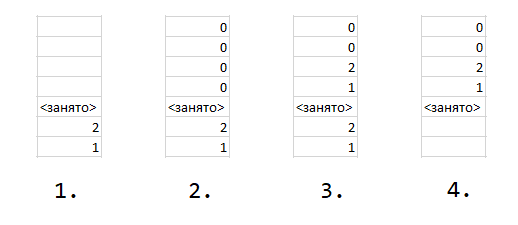

# Введение в классы и интерфейсы

## Обычная жизнь

### Массивы

Если хочется больше динамики, или хочется объеденить какие-то связанные по смыслу данные (а кроме того, и по типу), то можно применить **массивы**.

Примитивные массивы в разных ЯП могут быть как примитивными переменными, так и ссылочными. В первом случае работа с массивом будет быстрее, во втором — надёжнее и удобнее.

В любом случае управление памятю массива чаще всего ограничено правилами стэка и размер самого массива статичен и должен быть определён заранее.

Процесс изменения размера массива в большую сторону:

1. Найти место в памяти, которого хватает под новый размер массива;
2. Занять это место (объявить, что ячейки заняты, *и записать в них значения по умолчанию*);
3. Скопировать старые значения из предыдущего массива;
4. Освободить память от предыдущего массива, если это возможно (в стэке скорее всего останутся оба массива);

### Строки

Строки на самом деле являются частным случаем массива, состоящего из примитивов `char`. Поэтому ограничения на строки такие же, как на массивы.

### Недостатки

- Не настоящая динамика
- Нет возможности объединить общие данные разных типов
